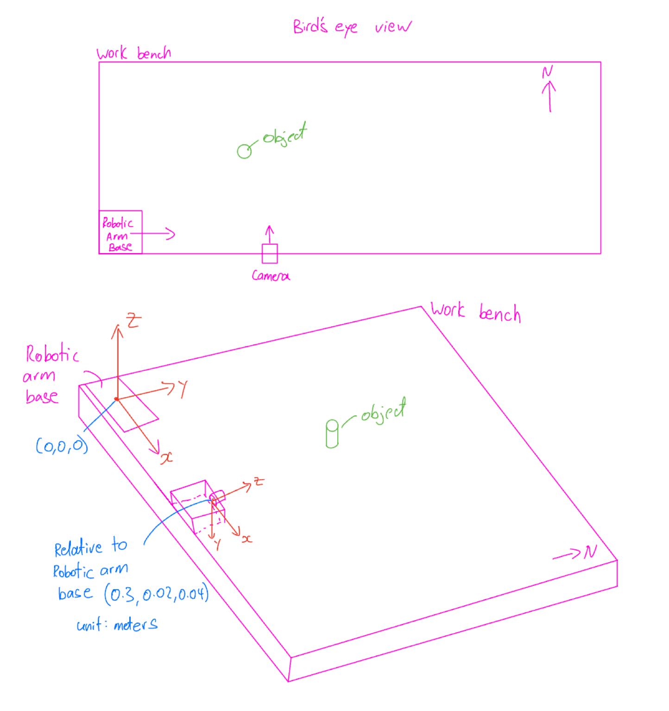

# CSCI 545 Personal Project on Visual Object Detection and Location for Robotic Arm Grasping

This project provides implementation for the automatic detection of an object using a pinhole camera and calculates the object's world coordinates used by a RRT path planning algorithm to produce a trajectory that graps the object.

## Project Component Overview

### Camera calibration: `camera_calibration.py`

In order to address the problem of image distortion caused by the pinhole camera, I utilized OpenCV to calibrate the camera. I choose the specific technique of using a checkerboard pattern ([Camera Calibration](https://docs.opencv.org/4.x/dc/dbb/tutorial_py_calibration.html)) to find the camera matrix and distortion coefficients that is used to undistort the image taken from the camera.

### Webcam picture taking: `webcam.py`

I used OpenCV to allow the user to take a photo using the webcam and save the image for processing.

### Object detection and camera frame coordinate calculation: `object_locator.py`

I chose to use the `yolov10s` model for detecting an object from the camera-taken image after experimenting with different versions of YOLO models. The `yolov10s` model demonstrated a good balance between runtime and accuracy, making it the ultimate choice. (Other models are stored under `YOLO_models/`)

Before the image is passed into the model, it is undistorted using the distortion coefficients to ensure that the output of the model is accurate. The model retruns the boundary of the object detected and the center-point of the object is calculated in pixel-frame.

Due to the lack of multiple cameras or a depth-sensor, I took on an alternative approach to determining the object's distance from the camera when calulating the object's camera frame coordinates. I decided to use a similar approach as Adrian ([Find distance from camera to object/marker using Python and OpenCV](https://pyimagesearch.com/2015/01/19/find-distance-camera-objectmarker-using-python-opencv/)), where upon setting up the camera for the first time, I would provide an object with known distance from camera as well as the height and width. The program will then be able to correclty find the dinstance of objects to follow.

### Object coordinate transformation from camera to world space: `convert_coordinates.py`

Given the pose of the robotic arm base and the pose of the camera with respect to the robotic arm, the program will figure out the tranfromation matrix that should be applied to camera frame object coordinate in order to obtain the world coordinate. The ouput object world coordinate can then be used to find a final end effector pose and a planed trajectory for the robotic arm to reach the object.

## How to Run

The program should be ran using `Python 3.9`, unless running simulation or path planning which should use an Unbuntu VM with python `Python 2.7`.

### Step 1: Installing libraries

Install the required libraries in `requirement.txt` by:

``` shell
pip install -r requirements.txt 
```

### Step 2: Camera calibration

Obtain a chckerboard printout from [Calibration Checkerboard Collection](https://markhedleyjones.com/projects/calibration-checkerboard-collection). 

The printout I used is `Checkerboard-A4-25mm-8x6.pdf`, and it should be printed out on an A4 sized paper and has 25mm squares with 8x6 verticie and 9x7 squares.

NOTE: Make sure to not change the scale when printing as it can effect the physcial size of the squares.

Using the checkerboard, take 15+ photos with the camera in different angles and distances away. But make sure that all the corners are visible. Save all the images in `calibration_images/` directory.

``` shell
# Run the calibration code
python camera_calibration.py 
```

The program will produce an Total re-projection error and a value <= 0.5 will be acceptable. If the error is higher, make sure that the images are of decent quality and take more images with greater diversity in angles and distances.

In addition a `calibration_data.npz` file will be outputed and will be used later.

### Step 3: Physical set up

Set up the camera and robotic arm on a workbench and record the pose.

Below is a depiction of how my setup looked like in lab: 

### Step 4: Calibrate object_loactor for distance measurement

First put the object at a known distance away from the camera (e.g. 200mm) and record the width and height of the object.

Then take an image of the object and run the code for object locator:

``` shell
# Take an image of the object through the webcam
# Default image saved as './captured_image.png'
python webcam.py  

# Running object locator in calibration mode
python object_locator.py --mode calibrate
```

When prompted for height, width, and distance, entering the pre-recorded info of the object. Once completed, the distance coefficients are stored in `distance_coefficient.npz` to be used later.

Verify that the output camera frame coordiante of the object is close to actual coordinates.

### Step 5: Run object_loactor for camera frame coordinates of object

Now that the object_locator is calibrated for use and the object can now be placed at any distance or position.

To find the coordinate of the object simply do the following:

``` shell
# Take another image of the object through the webcam
# Default image saved as './captured_image.png'
python webcam.py  

# Running object locator in use mode
# Will only be prompted to enter actual height of the object
python object_locator.py --mode use
```

A `filtered_result_[i].jpg` will be produced that shows the undistorded image of the object with bounding boxes for visual references. The camera frame coordinate of the object will be outputed in the terminal in the following format `[x y distance]` (e.g. `[9.1305 28.436 61.66]`). x is the horizontal distance from the center of the camera (+ve means right, -ve means left), y is the verticle distance (+ve = down, -ve = up), and distance is the distance away from the camera.

### Step 6: Converting to world coordinates

Now to convert the camera frame coordinates, run the following code:

``` shell
# Running world coordinate converter
python convert_coordinates.py 
```

Assuming the robot base pose to be `[0, 0, 0, 0, 0, 0]` (default), input the row, pitch, yaw and xyz coordinate of the camera along with the camera frame object coordinate when prompted. The output would be the world coordinate of the object.

### Step 7: End-effector pose and trajectory planning

Using a slightly adapted code from lab5 by inputting the coordinates of the object's world coordinates, an end-effector pose and trajectory for the robotic arm can be found:

``` shell
# Running in Ubuntu VM with python 2.7 and ROS
python code/soda_grasp_ik.py --sim 

# Visualize using
roscore

rviz rviz
```
